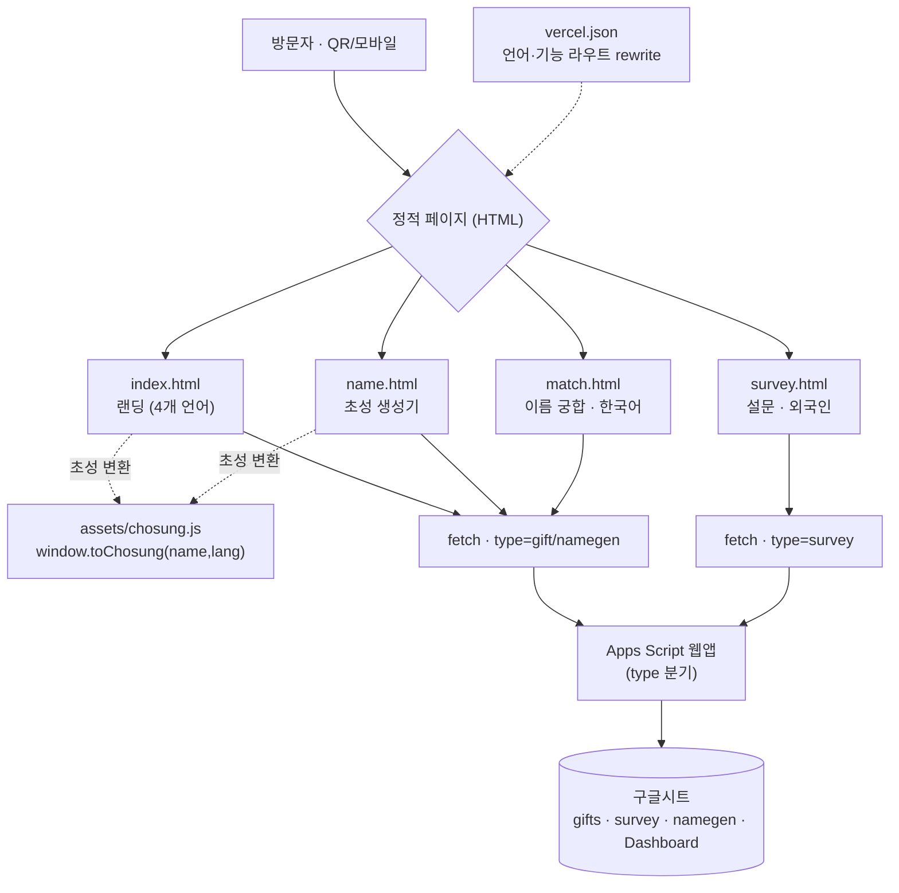

# 정본 — ㅈㄹ막걸리 × DOOTA 팝업 (표지)

> **이 폴더가 단일 진실(SSOT)이다.** 프로젝트의 확정된 모든 내용을 외부 md 참조 없이 자기완결로 담는다.
> 설명 문서(구 PRD/DESIGN/MEMORY)는 전부 여기 챕터로 통합됐다. 새 사실이 확정되면 새 md를 만들지 말고 해당 챕터를 갱신한다. (정본 규칙·작업 라우팅은 루트 `CLAUDE.md` 참조.)

## 목차
| 챕터 | 무엇 | 언제 읽나 |
|---|---|---|
| [01-개요와구조](01-개요와구조.md) | 제품·라우트·아키텍처(i18n·초성엔진)·기능·데이터·배포 | 스펙/구조/기능 작업 |
| [02-디자인](02-디자인.md) | "Kinetic Pink" 비주얼 시스템(컬러·타이포·컴포넌트) | **디자인 작업 = 이것만** |
| [03-변경이력](03-변경이력.md) | 결정·변경·버그 로그 (왜/어떻게, 계속 쌓임) | 맥락/이유 확인 |
| [04-할일과참고](04-할일과참고.md) | 열린 TODO + 운영 주의점(gotchas) | 작업 전 주의·남은 일 |

## 지금 확정된 것 (한장 요약)
- **무엇**: 두타몰 B2F 'ㅈㄹ막걸리 × DOOTA' 팝업용 **다국어(한·영·일·중) 정적 사이트** + 부가 페이지(생성기·궁합·설문).
- **기간/장소**: 2026.6.8 – 6.30 · 두타몰 B2F(서울 중구 장충단로 275) · 14:00–24:00(MON–SUN) · 무료.
- **슬로건**: `DRINK HAPPY NOT HEAVY`.
- **기술**: 정적 HTML(빌드 없음) + Google Apps Script/구글시트 백엔드 + Vercel. 다국어 i18n 내장, 초성 변환 엔진 공유(`assets/chosung.js`).
- **페이지**: 랜딩(`/`) · 초성 생성기(`/name`) · 이름 궁합(`/match`, 한국어 전용) · 설문(`/survey/*`, 외국인용).
- **핵심 기능**: 이름 초성 생성기·이름 궁합(스토리 카드 공유) / SNS 인증 기프트 가챠 / 시음 설문. 데이터는 구글시트.
- **배포**: GitHub `bokyunglee13-maker/zr_makgeolli` → Vercel(`zr-makgeolli.vercel.app` 가정).
- **상태**: WEBAPP_URL 연결·시트 적재·Analytics·小红书(zh)·운영시간 완료. 남은 일은 [04-할일과참고](04-할일과참고.md).

## 핵심 정보
| 항목 | 값 |
|---|---|
| 프로덕션 URL | https://zr-makgeolli.vercel.app *(가정 — OG 도메인 확정 전)* |
| 로컬 프리뷰 | `node .claude/serve.cjs` → http://localhost:5510 |
| 기술 스택 | 정적 HTML · Vanilla JS · Vercel (빌드 없음) |
| 백엔드 | Google Apps Script 웹앱 → 구글시트 |
| 다국어 | ko · en · ja · zh (각 페이지 i18n 내장) |
| 레포 | github `bokyunglee13-maker/zr_makgeolli` |
| 기간/장소 | 2026.6.8 – 6.30 · 두타몰 B2F |

## 전체 구조 (도식)

> 데이터 흐름: 페이지 → (공유 엔진으로 초성 변환) → `fetch`가 `type`으로 분기해 Apps Script로 POST → 구글시트 적재. 분석은 시트 + Vercel Analytics 2단. 상세는 [01-개요와구조](01-개요와구조.md).

## ⚠️ 형제 프로젝트 분리
`../zr-editions`(POLYC 에디션, Pastel Lilac)는 **별도 레포·별도 Vercel 배포**. 엔진(`chosung.js`)·로깅 엔드포인트만 공유한다. 에디션 작업은 거기서 하고 **이 레포(두타몰)는 건드리지 않는다.**
